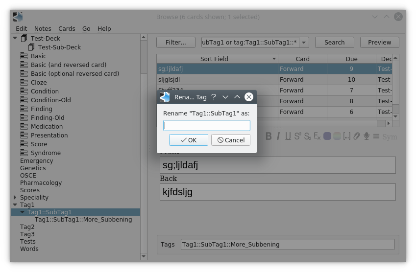

<b>This add-on is unsupported going forward. I strongly recommend using the <a href="https://ankiweb.net/shared/info/564851917" rel="nofollow">Blitzkrieg: Advanced Browser Sidebar</a> or Glutanimate's <a href="https://ankiweb.net/shared/info/594329229">Hierarchical Tags 2</a>.</b>

# Echelon

An Anki 2.1 Addon for Hierarchical Tags, with context aware renaming.

Based off the addon we know and love [Hierarchical Tags by pneff](https://ankiweb.net/shared/info/1089921461), ported to anki 2.1 plus some enhancements

* Clicking on a tag such as `it` will no longer show all cards with tags beginning in `it*`
* Allowing any tag separator - configurable in `Tools>Addons>Config`
* Renaming tags appropriate to the tag hierarchy on right click!

## Config

This add-on will work as expected out of the box, but there are some settings you can configure to suit your needs.

* `default_depth` - Default depth expanded to on opening the Browser. Set to 0 for a completely closed tree
* `full_tag` - Defaults to false. Means that the tag `Apple::Braeburn::Juicy` will be displayed as `Juicy` under the tags `Apple` and `Braeburn`
* `separator` - Defaults to `::` but can be changed if you're using something different.

## Renaming Tags

Right clicking on a tag in the browser will give you the option to enter a new name.

Echelon will then sensibly rename any child tags so that the hierarchy is preserved.

***

As ever feel free to suggest any features or raise any bugs!
